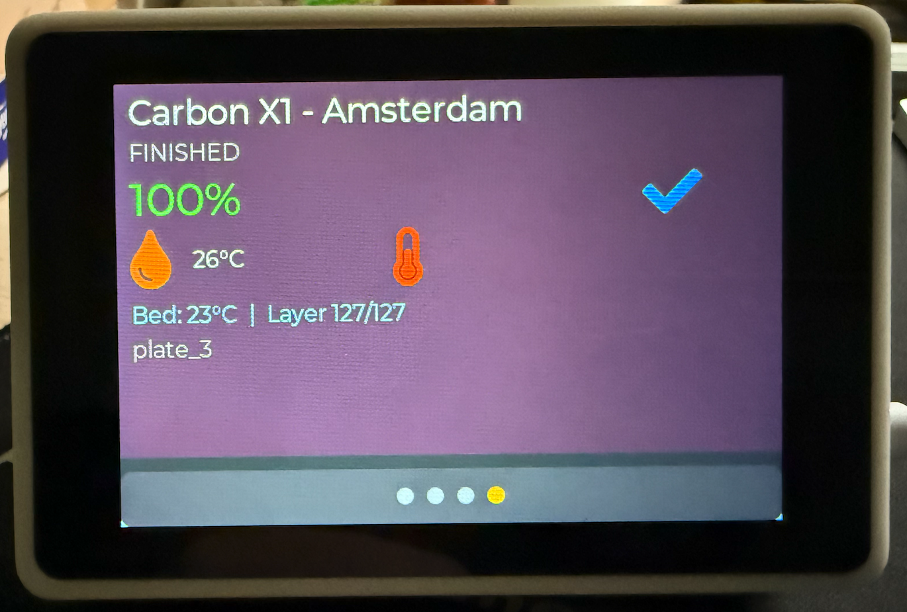

# ESP32-TUX Bambu Lab Monitor

A touchscreen dashboard for monitoring multiple Bambu Lab 3D printers in real-time.




## Features

- **Multi-Printer Carousel** — Monitor up to 6 printers with swipe navigation
- **Real-Time Updates** — Live progress, temperatures, and status via MQTT
- **Auto-Discovery** — Finds Bambu Lab printers on your network automatically
- **Weather Widget** — OpenWeatherMap integration with configurable location
- **WiFi Provisioning** — Easy setup via mobile app (no hardcoded credentials)
- **OTA Updates** — Update firmware wirelessly from GitHub releases
- **Dark/Light Themes** — Toggle between visual themes

---

## 🖨️ 3D Printable Case

**[Download on MakerWorld](https://makerworld.com/en/models/2102801-esp32-tux-bambu-lab-monitor)**

### About This Project

This touchscreen monitor was designed to solve a real problem: keeping tabs on multiple 3D printers across a workshop or office. The modular design makes it easy to customize for your specific needs.

**I built this project to be community-driven.** Whether you're a maker looking to modify it for your setup, a developer wanting to add new features, or just someone who wants a reliable printer monitor—I hope this helps you as much as it helps me.

The code is open, the hardware design is shareable, and the firmware updates automatically. If you improve something, consider contributing back!

---

## 🛒 Supported Hardware

| Device | WT32-SC01 Plus | Makerfabs ESP32-S3 |
|:-------|:--------------:|:------------------:|
| MCU | ESP32-S3 | ESP32-S3 |
| Display | 3.5" 480×320 | 3.5" 480×320 |
| Flash | 8MB | 16MB |
| PSRAM | 2MB | 2MB |
| Purchase | [Buy](https://bit.ly/wt32-sc01-plus) | [Buy](https://bit.ly/ESP32S3SPI35) |

The **WT32-SC01 Plus** is recommended — it's compact, affordable, and works great with the 3D printable case.

---

## ⚡ Quick Start

### Step 1: Flash the Firmware

#### Option A: Web Installer (Easiest)

1. Connect your device via USB-C data cable
2. Open Chrome/Edge on desktop: **[Web Installer](https://mybesttools.github.io/ESP32-TUX-BAMBULAB/)**
3. Click "Connect" and select your device
4. Click "Install" and wait for completion

> **Note:** Close any serial monitors before flashing. Works on Windows, Mac, Linux, and Chromebook.

#### Option B: Download Binary

1. Download `ESP32-TUX.bin` from [Latest Release](https://github.com/mybesttools/ESP32-TUX-BAMBULAB/releases/latest)
2. Flash using esptool or ESP-IDF:
   ```bash
   esptool.py --port /dev/cu.usbmodem* write_flash 0x0 ESP32-TUX.bin
   ```

### Step 2: Connect to WiFi

1. **Power on** the device — it will create a WiFi hotspot: `PROV_XXXXXX`
2. **Connect** your phone to that network
3. **Open browser** and go to `http://192.168.4.1`
4. **Select your WiFi** network and enter password
5. Device will reboot and connect to your network

Or use the **Espressif BLE Provisioning** app ([iOS](https://apps.apple.com/app/esp-ble-provisioning/id1473590141) / [Android](https://play.google.com/store/apps/details?id=com.espressif.provble)).

### Step 3: Add Your Printers

1. Go to **Settings** → **Printers** on the device
2. Tap **"Scan"** to auto-discover printers on your network
3. Select a printer and enter its **Access Code** (found in printer settings → Network → LAN Mode)
4. Repeat for additional printers

### Step 4: Add Weather (Optional)

1. Get a free API key from [OpenWeatherMap](https://openweathermap.org/api)
2. Go to **Settings** → **Weather** on the device
3. Enter your API key and location

---

## 🔄 Updating Firmware

The device checks for updates automatically. When an update is available:

1. Go to **Settings** → **OTA Update**
2. Tap **"Check for Updates"**
3. If available, tap **"Install"**
4. Device will download, install, and reboot

Your settings (WiFi, printers, API keys) are preserved across updates.

---

## 🔧 Building from Source

For developers who want to customize or contribute:

### Prerequisites

- [ESP-IDF v5.1.5+](https://docs.espressif.com/projects/esp-idf/en/latest/esp32s3/get-started/)
- USB-C data cable

### Build & Flash

```bash
# Clone the repository
git clone https://github.com/mybesttools/ESP32-TUX-BAMBULAB.git
cd ESP32-TUX-BAMBULAB

# Source ESP-IDF environment
. ~/esp-idf/export.sh

# Set target and configure
idf.py set-target esp32s3
idf.py menuconfig  # Select your device under "TUX Configuration"

# Build and flash
idf.py build
idf.py -p /dev/cu.usbmodem* flash monitor
```

### Quick Flash Script (Preserves Settings)

```bash
./flash_quick.sh /dev/cu.usbmodem21201
```

See [FLASHING_GUIDE.md](FLASHING_GUIDE.md) for detailed instructions.

---

## 📖 Documentation

- [Bambu Integration Quick Start](docs/BAMBU_QUICKSTART.md)
- [Flashing Guide](FLASHING_GUIDE.md)
- [Technical Design](docs/BAMBU_TECHNICAL_DESIGN.md)

---

## 🤝 Contributing & Community

This project is maintained as open-source to encourage innovation and collaboration.

### Ways to Contribute

1. **Build the case and share your photos** — Post build pictures on MakerWorld or GitHub
2. **Report issues** — Found a bug? Open an [Issue](https://github.com/mybesttools/ESP32-TUX-BAMBULAB/issues)
3. **Request features** — Have an idea? Start a [Discussion](https://github.com/mybesttools/ESP32-TUX-BAMBULAB/discussions)
4. **Submit pull requests** — Improvements are always welcome
5. **Share your customizations** — Modified the firmware for your setup? We'd love to hear about it

### Customization Ideas

- Add support for other 3D printer brands (Prusa, Creality, Ender3, etc.)
- Integrate with Home Assistant or Node-RED
- Add network camera feeds
- Create alternative UI themes
- Support additional languages
- Build enclosures for different environments

### Development Setup

```bash
# Fork the repository
git clone https://github.com/YOUR-USERNAME/ESP32-TUX-BAMBULAB.git
cd ESP32-TUX-BAMBULAB

# Create a feature branch
git checkout -b feature/your-feature-name

# Make your changes, test, and commit
git push origin feature/your-feature-name

# Open a pull request on GitHub
```

See [CONTRIBUTING.md](CONTRIBUTING.md) for detailed guidelines *(coming soon)*.

---

## 📞 Support & Feedback

- **Questions?** Open a [GitHub Discussion](https://github.com/mybesttools/ESP32-TUX-BAMBULAB/discussions)
- **Found a bug?** Open a [GitHub Issue](https://github.com/mybesttools/ESP32-TUX-BAMBULAB/issues)
- **Want to chat?** Star the repo to stay updated on releases

---

## 🙏 Credits

**Original Project:** [ESP32-TUX](https://github.com/sukesh-ak/ESP32-TUX) by [Sukesh Ashok Kumar](https://github.com/sukesh-ak)

This project is a fork with Bambu Lab integration, maintained by [Mike van der Sluis](https://github.com/mybesttools).

**Libraries:**
- [LovyanGFX](https://github.com/lovyan03/LovyanGFX) — Display driver
- [LVGL 8.x](https://github.com/lvgl/lvgl) — UI framework
- [ESP-IDF](https://github.com/espressif/esp-idf) — Espressif framework

---

## 📄 License

MIT License — See [LICENSE](LICENSE) for details.
